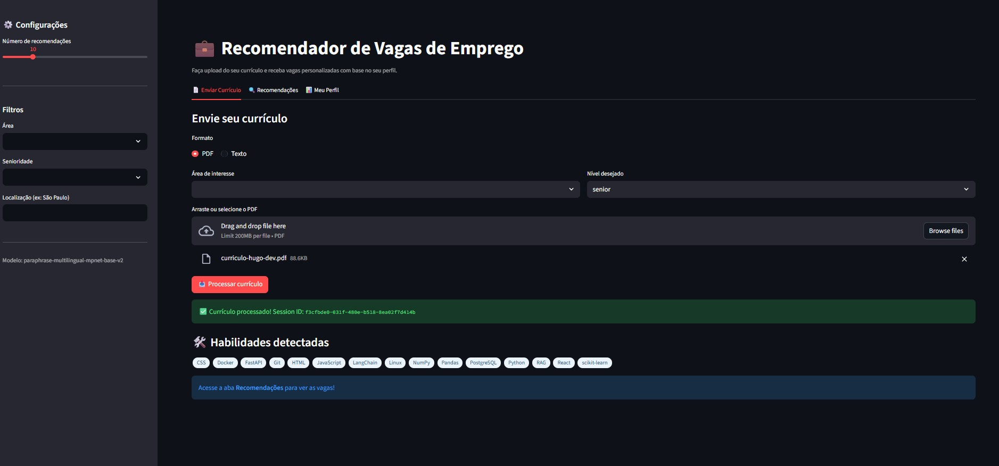
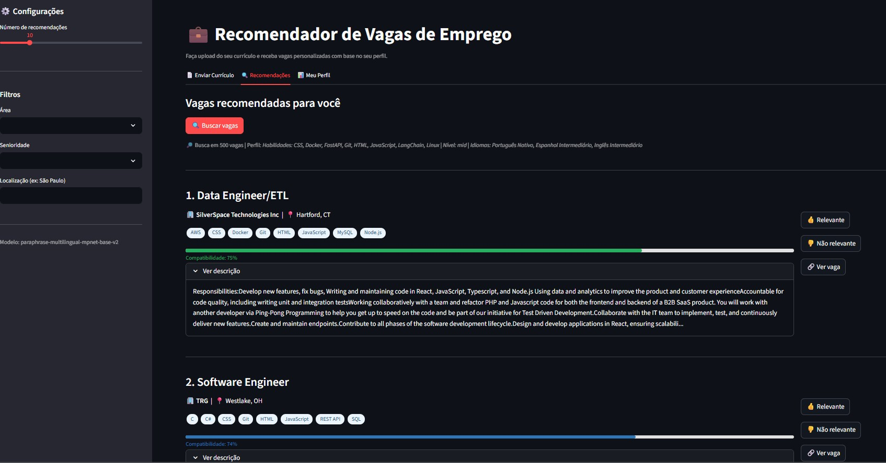
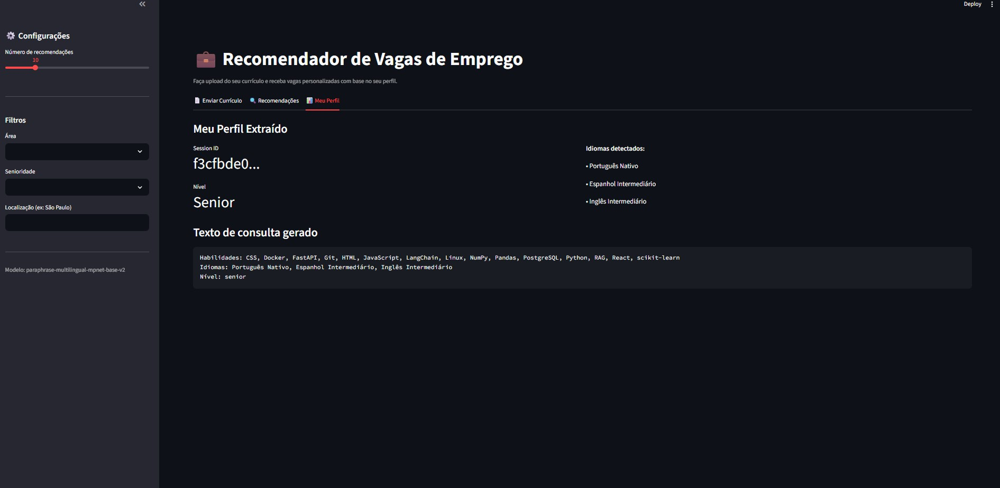

# 💼 HireMatch

> Sistema inteligente de recomendação de vagas de emprego com NLP e embeddings semânticos.

HireMatch analisa o seu currículo (PDF ou texto), extrai automaticamente suas habilidades, experiências e idiomas, e recomenda as vagas mais compatíveis com o seu perfil usando similaridade semântica — indo muito além de simples palavras-chave.

---

## 🖥️ Interface

### Tela 1 — Envio do Currículo
Faça upload do seu currículo em PDF ou cole o texto diretamente. O sistema processa automaticamente e detecta suas habilidades técnicas.



### Tela 2 — Vagas Recomendadas
Visualize as vagas rankeadas por compatibilidade semântica com seu perfil, com barra de porcentagem, habilidades exigidas e botões de feedback.



### Tela 3 — Meu Perfil
Veja o perfil extraído do seu currículo: nível, idiomas detectados e o texto de consulta gerado para o motor de busca semântica.



---

## ⚙️ Como Funciona

```
Currículo (PDF/texto)
        ↓
   Parser (spaCy)
        ↓
 Extração de habilidades, experiências, idiomas
        ↓
 Embedding do perfil (Sentence-Transformers)
        ↓
 Busca por similaridade no ChromaDB
        ↓
 Vagas rankeadas por compatibilidade
```

1. O usuário faz upload do currículo
2. O parser extrai habilidades, cargos, formação e idiomas
3. O sistema gera um embedding semântico do perfil
4. Busca as vagas mais próximas no vetor de embeddings (cosine similarity)
5. Retorna as vagas rankeadas com score de compatibilidade

---

## 🛠️ Stack Tecnológica

| Camada | Tecnologia |
|--------|-----------|
| API REST | FastAPI |
| Banco relacional | PostgreSQL |
| Vector store | ChromaDB |
| Cache | Redis |
| Embeddings | Sentence-Transformers (`paraphrase-multilingual-mpnet-base-v2`) |
| NLP / Parser | spaCy (`pt_core_news_lg`) |
| Tarefas assíncronas | Celery |
| Interface | Streamlit |
| Containerização | Docker / Docker Compose |

---

## 🚀 Como Rodar Localmente

### Pré-requisitos

- Python 3.11+
- Docker Desktop

### 1. Clone o repositório

```bash
git clone https://github.com/hugo-ryanf/Academic-System-Scraper.git
cd Academic-System-Scraper
```

### 2. Crie o ambiente virtual e instale as dependências

```bash
python -m venv venv
source venv/Scripts/activate  # Windows
# ou
source venv/bin/activate      # Linux/Mac

pip install -r requirements.txt
python -m spacy download pt_core_news_lg
```

### 3. Configure as variáveis de ambiente

```bash
cp .env.example .env
```

### 4. Suba os serviços com Docker

```bash
docker-compose up -d postgres redis chromadb
```

### 5. Ingira o dataset de vagas

Baixe o dataset [LinkedIn Job Postings](https://www.kaggle.com/datasets/arshkon/linkedin-job-postings) do Kaggle, coloque o `job_postings.csv` dentro da pasta `data/` e rode:

```bash
python data/ingest_dataset.py --csv data/job_postings.csv --limit 5000
```

### 6. Inicie a API

```bash
uvicorn app.main:app --reload
```

### 7. Inicie a interface

Abra um novo terminal e rode:

```bash
streamlit run app/ui/streamlit_app.py
```

Acesse em: **http://localhost:8501**

---

## 📡 Endpoints da API

| Método | Endpoint | Descrição |
|--------|----------|-----------|
| `POST` | `/api/v1/profile/pdf` | Cria perfil a partir de PDF |
| `POST` | `/api/v1/profile/text` | Cria perfil a partir de texto |
| `GET` | `/api/v1/profile/{session_id}` | Retorna perfil existente |
| `POST` | `/api/v1/recommend` | Retorna vagas recomendadas |
| `POST` | `/api/v1/jobs` | Adiciona nova vaga |
| `GET` | `/api/v1/jobs` | Lista vagas |
| `POST` | `/api/v1/feedback` | Registra feedback do usuário |
| `GET` | `/api/v1/metrics/{session_id}` | Calcula Precision@K |

Documentação interativa disponível em: **http://localhost:8000/docs**

---

## 📁 Estrutura do Projeto

```
hirematch/
├── app/
│   ├── api/
│   │   └── routes.py          # Rotas FastAPI
│   ├── core/
│   │   ├── config.py          # Configurações
│   │   ├── database.py        # Conexão PostgreSQL
│   │   └── celery_app.py      # Configuração Celery
│   ├── models/
│   │   ├── db_models.py       # Modelos SQLAlchemy
│   │   └── schemas.py         # Schemas Pydantic
│   ├── services/
│   │   ├── parser.py          # Parser de currículo
│   │   ├── embedder.py        # Geração de embeddings
│   │   ├── recommender.py     # Motor de recomendação
│   │   └── tasks.py           # Tarefas Celery
│   ├── ui/
│   │   └── streamlit_app.py   # Interface Streamlit
│   └── main.py                # Entrypoint FastAPI
├── data/
│   └── ingest_dataset.py      # Script de ingestão
├── tests/
│   └── test_all.py            # Testes unitários
├── docker-compose.yml
├── Dockerfile
└── requirements.txt
```

---

## 🧪 Testes

```bash
pytest tests/ -v
```

---

## 📊 Métricas de Avaliação

O sistema suporta as seguintes métricas para avaliar a qualidade das recomendações:

- **Precision@K** — proporção de vagas relevantes nos K primeiros resultados
- **Cosine Similarity** — score de compatibilidade semântica entre perfil e vaga

---

## 👤 Autor

**Hugo Ryan**
[github.com/hugo-ryanf](https://github.com/hugo-ryanf)

---

## 📄 Licença

Este projeto está sob a licença MIT.